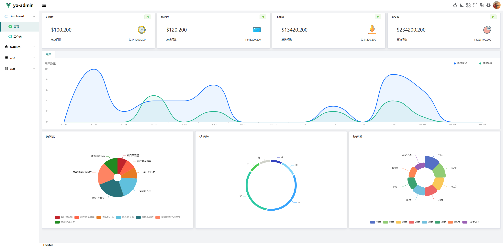
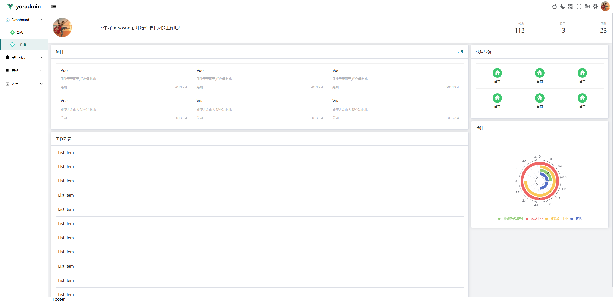
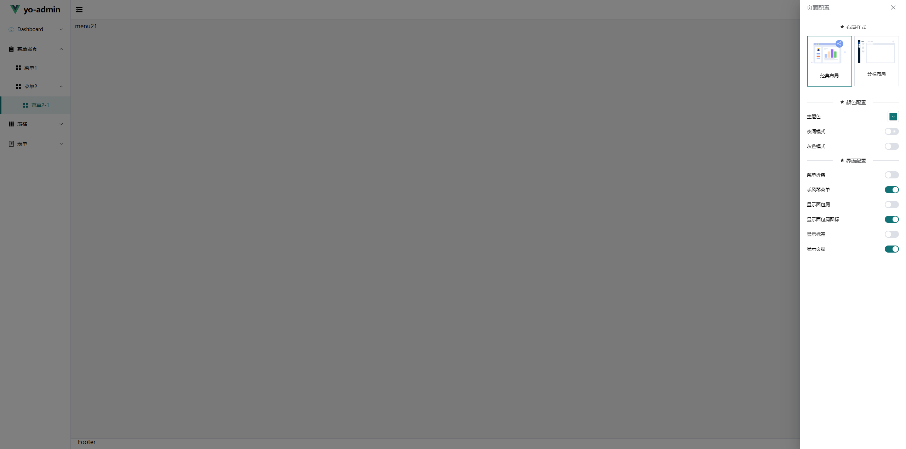

# yo-admin

## 简介

yo-vue-admin 是一个基于 Vue 3、TypeScript、Vite、Pinia、Element Plus、Vue Router、Axios、ECharts 等技术栈的前端项目模板，旨在为开发者提供一套高效、易用的开发环境，帮助开发者快速搭建和管理前端项目。

## 推荐的 IDE 设置

[VSCode](https://code.visualstudio.com/) + [Volar](https://marketplace.visualstudio.com/items?itemName=Vue.volar) (and disable Vetur) + [TypeScript Vue Plugin (Volar)](https://marketplace.visualstudio.com/items?itemName=Vue.vscode-typescript-vue-plugin).

## 特性

- 使用 Vue 3 Composition API
- 使用 TypeScript
- 使用 Vite 作为构建工具
- 使用 Pinia 作为状态管理工具
- 使用 Element Plus 作为 UI 框架
- 使用 Vue Router 作为路由管理工具
- 使用 Axios 作为 HTTP 客户端
- 使用 ECharts 作为图表库
- 使用 ESLint 和 Prettier 进行代码检查和格式化
- 使用 Husky 和 Lint-staged 进行 Git 钩子管理

## 预览





## 安装使用

```sh
pnpm install
```

### 开发环境

```sh
pnpm run dev
```

### 打包

```sh
pnpm run build
```

### 代码检查

```sh
pnpm run lint
```
